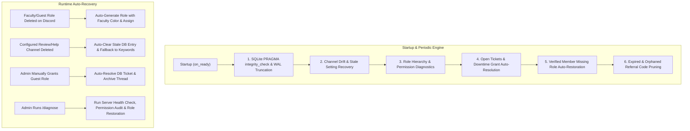
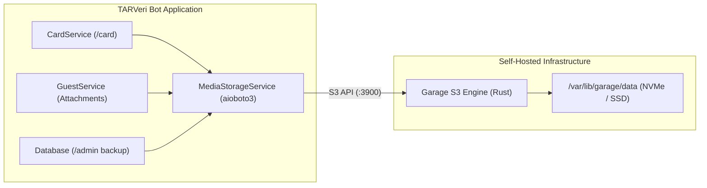
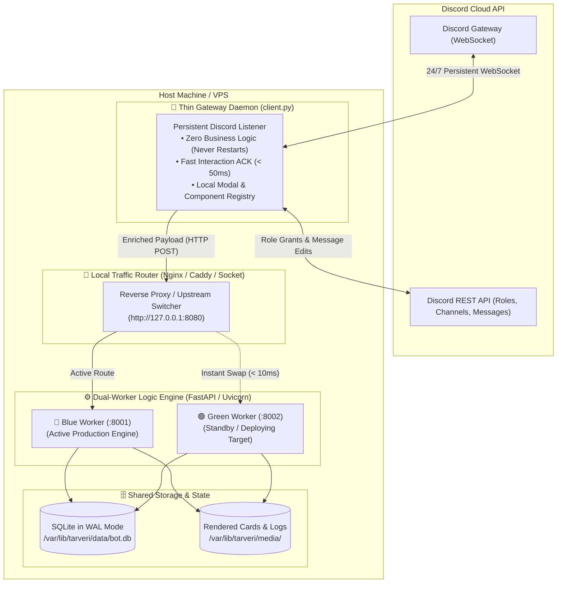
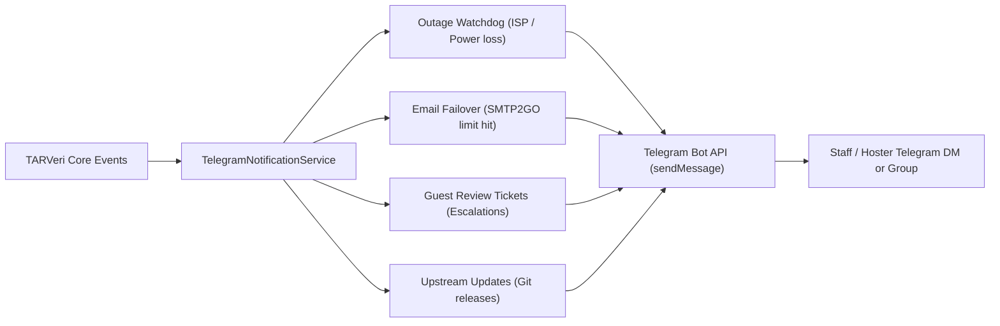

# 🎓 TARVeri — Bot Architecture, Runbook & Self-Healing Guide

TARVeri is a production-grade Discord student & guest verification bot built for TARUMT (Tunku Abdul Rahman University of Management and Technology). It assigns faculty roles to students based on their student IDs and orchestrates a two-step review workflow for non-TARUMT guests.

---

## 🏗️ Architecture & Module Layout

```
Student-verifier/
├── tarveri/
│   ├── __init__.py               # Top-level exports and versioning
│   ├── __main__.py               # python -m tarveri entrypoint
│   ├── bot.py                    # TARVeriBot lifecycle, persistent views, startup self-healing
│   ├── config.py                 # Settings, faculty mappings, programme code extraction, NDR bounce detection, HMAC hashing
│   ├── database.py               # Async SQLite layer (WAL mode, PRAGMAs, migrations, bounced_emails table, legacy backfill)
│   ├── rate_limiter.py           # Monotonic sliding-window rate limiting
│   ├── utils.py                  # Ticket formatting (#A0001), TTL schedulers, timestamp parsers
│   ├── services/
│   │   ├── verification_service.py      # Student verification logic, role auto-creation, reconciliation, role recovery, mass action guards
│   │   ├── email_service.py             # Institutional student email OTP generator, dual SMTP relay, NDR bounce detection, and Fernet authenticated encryption
│   │   ├── graduation_watchdog_service.py # Periodic graduation & card expiry watchdog daemon
│   │   ├── card_service.py              # Digital campus card rendering, Pillow glassmorphism, badge system
│   │   ├── guest_service.py             # Referral codes, double verification, batch staff tagging, escalation
│   │   ├── log_service.py               # Daily log rotation, 10-day period grouping & .tar.gz compression
│   │   ├── outage_service.py            # Network probe watchdog, debounce & power outage signals
│   │   └── update_checker.py            # Background git upstream check and DM notifications
│   └── cogs/
│       ├── verification_cog.py   # Student slash (/verify, /graduate) and text commands, welcome/help auto-tips, lifecycle UI
│       ├── card_cog.py           # Campus card slash (/card) and user context menu apps
│       ├── guest_cog.py          # Guest gateway panel, private review thread views, vouchers
│       ├── admin_dashboard.py    # Rich interactive admin control center UI with category dropdowns
│       └── admin_cog.py          # Admin tools (/stats, /diagnose, /audit, /unverify, /backup, /logs, /backfill_roles, /restore_roles)
├── scripts/
│   ├── update.sh                 # Safe upstream git updater with backup and test preflight
│   └── show_servers.py           # CLI database inspector for server settings and metrics
└── tests/                        # 235 unit & integration tests covering all modules with 0 warnings
```

---

## 🛡️ Self-Healing & Auto-Recovery Engine



### 1. Database Integrity & WAL Checkpoint
- Runs `PRAGMA integrity_check` upon connection startup.
- Executes `PRAGMA wal_checkpoint(TRUNCATE)` on startup and shutdown to keep disk space minimal and SQLite WAL clean.
- Uses `Database.clear_stale_channel_setting(guild_id, channel_type)` to wipe invalid Discord channel IDs from `guild_settings`.

### 2. Channel Self-Healing & User-Accessible Thread Channel Discovery
- When `find_parent_review_channel`, `get_welcome_or_verify_channel`, or `is_help_channel` encounters a configured channel ID that no longer exists on Discord, it:
  1. Clears the stale setting from SQLite.
  2. Prioritizes user-accessible public channels (`#ask-for-help`, `#help`, `#support`, `#verify`, `#guest`) where normal/unverified users have `view_channel=True`, preventing threads from being spawned in admin/staff-locked channels where applicants cannot see or join the thread.
  3. Verifies bot permissions (`view_channel`, `create_private_threads`, `send_messages_in_threads`, `send_messages`).
  4. **Auto-Channel Creation Fallback**: If no user-accessible parent channel exists and the bot possesses `manage_channels`, TARVeri automatically provisions `#ask-for-help` with correct `@everyone` read/write permissions, binds it to SQLite default usage, and posts a pinned welcome guidance embed.
  5. Explicitly grants `view_channel=True`, `send_messages_in_threads=True`, `read_message_history=True` to the applicant and referring student on the parent channel so they can seamlessly view and interact in private review threads.

### 3. Dynamic Faculty Role Re-Creation
- If an admin deletes a faculty or guest role, the service detects `role is None` and automatically recreates it with standard server design colors:
  - **FAFB**: `#992D22` (Dark Red)
  - **CPUS**: `#1F8673` (Dark Teal)
  - **FOCS**: `#F1C40F` (Yellow / Gold)
  - **FCCI**: `#71368A` (Dark Purple)
  - **FOAS**: `#E74C3C` (Red / Coral Red)
  - **FOBE**: `#2ECC71` (Green / Emerald)
  - **FSSH**: `#3498DB` (Blue)
  - **FOET**: `#BAE973` (Lime Green)
  - **Guest (Approved)**: `#2ECC71` (Green / Emerald)

### 4. Downtime Manual Grant Detection
- If an admin manually grants the `Guest(Approved)` role to an applicant during maintenance or while a ticket is open, `reconcile_downtime_state()` detects `guest_role in applicant.roles`:
  - Closes the ticket as `APPROVED` (*"Applicant was manually granted guest role by admin"*).
  - Updates referral code to `USED`.
  - Sends a notice in the review thread and archives/locks it.

### 5. Returning Verified Member & Alumni Role Auto-Restoration
- `VerificationService.reconcile_verified_members(guild)` checks all verified students in the database against present guild members and restores missing faculty roles.
- `VerificationService.reconcile_alumni_members(guild)` checks all claimed alumni in the database and restores the `TARUMT Alumni` role across mutual servers during bot startup and `/diagnose`.

### 6. Duplicate Role Reconciliation & Cleanup Engine
- `VerificationService.reconcile_duplicate_roles(guild)` automatically scans guilds for duplicate roles partitioned across strict domain categories:
  - **Faculty Roles**: `FACULTY_ROLE_NAMES` (`FAFB`, `CPUS`, `FOCS`, `FCCI`, `FOAS`, `FOBE`, `FSSH`, `FOET`).
  - **Study Level Roles**: `STUDY_LEVEL_ROLE_NAMES` (`Diploma`, `Degree`, `Foundation`, `Postgraduate`).
  - **Branch Campus Roles**: `CAMPUS_ROLE_NAMES` (`KL Main Campus`, `Penang Branch`, etc.).
  - **Guest Roles**: Configured or regex-matched guest roles.
- **Cross-Domain Separation (CPUS vs Foundation)**:
  - **CPUS** is strictly matched as an academic faculty (`Centre for Pre-University Studies`), never as a study level.
  - **Foundation** is strictly matched as a study level, never as a faculty.
  - Reconciliation groups are fully isolated so `CPUS` and `Foundation` roles never collide, misidentify, or trigger mutual deletion during self-healing.
- Identifies the primary role (highest position in role hierarchy and member count).
- Migrates all members on redundant duplicate role(s) to the primary role (`add_roles` + `remove_roles`).
- **Strict Bot-Created Protection**: ONLY deletes redundant duplicate role(s) that were created by the bot (tracked via SQLite `bot_created_roles` and Discord audit logs). Admin-created roles are strictly preserved.
- Automatically invoked during bot startup self-healing and via the `/diagnose` slash command.

### 7. Role Hierarchy & Permission Diagnostics (`/diagnose`)
- Compares `guild.me.top_role.position` against managed roles (`Guest(Approved)`, `TARUMT Verified`, `TARUMT Alumni`, faculty roles).
- Detects duplicate roles and logs alerts if the bot lacks `Manage Roles` or if a managed role is higher than the bot's top role.
- Administrators can trigger this anytime via `/diagnose`.

### 8. SRC & Council Role Protection & Auto-Restoration
- Protects organizational, council, and functional roles (`ROLE_QUALIFIER_PATTERN`: `SRC`, `Council`, `Exco`, `Committee`, `Staff`, `Rep`, etc.) from being matched as generic faculty roles or cleaned up during deduplication.
- `VerificationService.restore_src_roles(guild)` checks for all 8 faculty SRC roles (`FAFB SRC`, `CPUS SRC`, `FOCS SRC`, `FCCI SRC`, `FOAS SRC`, `FOBE SRC`, `FSSH SRC`, `FOET SRC`).
- Recreates missing SRC roles using their corresponding official faculty palette colors and mentionable flag on bot startup and during `/diagnose`.

### 9. Alumni & Graduation Transition System
- Verified students self-claim alumni status via `/graduate [year] [programme]` (or an interactive modal popup).
- Auto-creates/assigns the `TARUMT Alumni` role (`#D4AF37` Academic Gold) across mutual guilds.
- Updates the Digital Campus Card (`/card` and user context menu) to display `GRADUATED ALUMNI` status pill, `❖ ALUMNI` achievement badge, and `Class of [Year] • [Faculty] Alumni` cohort subtitle.
- Admins can revoke alumni status via `/alumni_revoke @user [reason]`.

### 10. Network & Power Outage Watchdog (`OutageService`)
- Continuously monitors Discord gateway status, socket reachability (raw DNS IPs `1.1.1.1:53`, `8.8.8.8:53`, and `discord.com:443`), and OS signals (`SIGPWR`, `SIGTERM`, `SIGINT`, `SIGHUP`).
- **5-Minute Grace Period**: When a network outage or gateway disconnect is detected, starts a 5-minute (300-second) watchdog countdown.
- **Auto-Recovery**: If internet or gateway connectivity restores within 5 minutes, automatically cancels the countdown and resumes normal operations.
- **Emergency Graceful Shutdown**: If the outage persists continuously for 5 minutes, or if an OS power failure signal (`SIGPWR`) is received from UPS / systemd, initiates an emergency graceful shutdown, cleanly checkpointing SQLite WAL to protect against database corruption.

### 11. Daily Log Rotation & 10-Day Period Tar.Gz Archiving (`LogRotationService`)
- **Daily Log Partitioning**: All application logs are stored in `logs/` and partitioned by calendar day (`logs/tarveri-YYYY-MM-DD.log`) using the configured timezone (`Asia/Kuala_Lumpur`).
- **10-Day Decade Grouping**: Daily logs older than 10 days are automatically discovered and grouped into 10-day decade bins by year and month:
  - Part 1: Days 01–10 (`tarveri-logs-YYYY-MM-01_to_YYYY-MM-10.tar.gz`)
  - Part 2: Days 11–20 (`tarveri-logs-YYYY-MM-11_to_YYYY-MM-20.tar.gz`)
  - Part 3: Days 21–End (`tarveri-logs-YYYY-MM-21_to_YYYY-MM-(28..31).tar.gz`)
- **Automated Tarball Compression & Cleanup**: Bundles old logs into gzip-compressed `.tar.gz` archives in `logs/archives/`, seamlessly merging with existing archives if needed, and safely deletes uncompressed log files to conserve disk space.
- **On-Demand Admin Management**: Inspect daily logs, archives, and manually trigger compression anytime using `/logs`.

### 12. Branch Campus & Study Level Roles & Backfill Engine
- **ID Structure Decomposition**: Parses TARUMT student IDs (`YY[B][F][L]XXXXX` e.g. `24WMD12345` or `23PMR12345`):
  - **Branch Campuses**: `W` (KL Main Campus), `P` (Penang Branch), `A` (Perak Branch), `J` (Johor Branch), `C`/`K` (Pahang Branch), `S` (Sabah Branch).
  - **Study Levels**: `D` (Diploma), `R` (Bachelor's Degree), `F` (Foundation), `P` (Postgraduate / Master / PhD).
- **Atomic Multi-Role Provisioning**: When verified, students concurrently receive:
  1. Base verification role (`TARUMT Verified` / `#16A085`)
  2. Faculty role (e.g. `FOCS` / `#F1C40F`)
  3. Campus role (e.g. `TARUMT KL Main Campus` / `#2980B9`, `TARUMT Penang Campus` / `#16A085`, etc.)
  4. Study level role (e.g. `Bachelor's Degree` / `#8E44AD`, `Diploma` / `#3498DB`, `Foundation` / `#E67E22`, `Postgraduate` / `#9B59B6`)
- **Backward Compatible Auto-Migration**: Automatically adds `campus_code` and `level_code` columns to SQLite `verifications` table.
- **Legacy Backfill Engine**: Automatically maps legacy records without campus/level tags (defaults `W` and `R`), reconciles with existing Discord guild roles during `reconcile_verified_members()`, and provides administrative migration via `/admin backfill_roles`.

### 13. Expiry Date Anomaly Guard & Interactive Lifecycle Interception
- **8-Year Deviation Guard (`is_expiry_date_anomalous`)**: Detects ambiguous date entries (e.g. `06/07` intended as 6th July interpreted as June 2007) or dates deviating by $\pm 8$ years from the student's intake year.
- **Interactive Correction Menu (`ExpiryAnomalyConfirmView`)**: Intercepts anomalous dates before role modifications and presents 3 interactive buttons:
  - **`Confirm Date`**: Proceeds with the input date and assigns roles or triggers alumni transition.
  - **`Re-enter Date`**: Launches a 1-click re-input modal (`ExpiryReentryModal`) with dynamic formatting hints.
  - **`Auto-Calculate`**: Computes standard graduation expiry based on study level (`F`: +1y, `D`: +2y, `R`: +3y, `P`: +2y).
- **Active-Chat Graduation Prompts**: When a student with an expired card participates in server channels, TARVeri delivers an interactive lifecycle resolution menu (🎓 Graduated Alumni / 📚 Further Studies / ⏳ Extend Expiry / 🚪 Discontinue Studies).
- **Discontinuation & Dropout Self-Service (`StudentDropoutConfirmModal`)**: Students who discontinue their studies can voluntarily withdraw verification via the resolution prompt or `/dropout`. Requires typing an explicit confirmation phrase (`"Yes, I am dropping out."`) to prevent accidental clicks before revoking student roles across mutual guilds and clearing SQLite records.
- **Graduation Watchdog Daemon (`GraduationWatchdogService`)**: Runs daily background sweeps to identify expired cards and send courteous DM notices with a 7-day cooldown.

### 14. Real-Time Member Departure, Ban, & Downtime Ticket Auto-Cleanup
- **Real-Time Event Orchestration (`on_member_remove` & `on_member_ban`)**:
  - When an applicant or referring student leaves, is kicked, or is banned:
    1. Sends a departure notice in the review thread (`"🛑 Guest applicant left the server..."`).
    2. Immediately locks and archives the private review thread.
    3. Cleans up temporary parent channel permission overwrites.
    4. Updates database ticket status to `LEFT_SERVER` or `BANNED`.
    5. Instantly revokes any active referral codes generated by the user and cancels open referred tickets.
- **Downtime & Maintenance Reconciliation (`reconcile_downtime_state`)**:
  - Automatically sweeps for departed members, banned users, and manual admin role assignments that occurred while the bot was offline, ensuring zero ghost tickets or orphaned threads.

### 15. Sliding Century Windowing & Zero Hardcoded Dates
- **100% Dynamic Time Analysis**: All validation logic, century thresholding, intake year bounds, and example placeholders compute dynamically relative to `datetime.now().year` (`1969 <= year <= datetime.now().year + 5`).
- **Zero Hardcoded Time-Locks**: Prevents obsolescence and guarantees future-proof operation across calendar years.

### 16. Institutional Student Email Verification & Dual-SMTP Relay Engine
- **2-Factor Email OTP Verification (`EmailService`)**:
  - Verifies ownership of official TARUMT institutional mailboxes (`<abbr>-<branch><fac><intake>@student.tarc.edu.my`, e.g. `yaplz-wm23@student.tarc.edu.my` or `@tarc.edu.my`).
  - Generates secure 6-digit one-time codes with a 10-minute TTL and real-time Discord relative timestamp countdowns (`<t:{expire_ts}:R>`).
  - Enforces 3-attempt brute-force protection (invalidating the code on the 3rd wrong attempt) and a 60-second resend rate limit.
  - **Smart Cooldown Bypass on Correction**: If a user corrects a mistyped email or ID, the 60-second cooldown is automatically bypassed to avoid frustrating legitimate users.
  - **Lazy Memory Pruning**: In-memory transient OTP entries are pruned automatically upon any service access.
- **Authenticated Encryption at Rest (Fernet)**:
  - All student email addresses are encrypted at rest with Fernet (AES-128-CBC with HMAC-SHA256 authenticated encryption) before storing in the SQLite `verifications` table (`student_email_encrypted`).
- **HMAC-SHA256 Blind Indexing (`student_email_hash`)**:
  - Deterministic HMAC-SHA256 blind indexing allows fast $O(1)$ duplicate email collision checks at rest without decrypting or storing plaintext emails.
- **Primary & Fallback Dual-SMTP Architecture**:
  - Transmits via high-deliverability primary SMTP relay (e.g. SMTP2GO port 587) with automatic fallback to a direct secondary SMTP mailbox server on quota depletion or network timeout.
- **Per-Server Opt-In / Opt-Out & Quota Protection**:
  - Servers can mandate email verification per-guild (`/admin email_verification enabled:True|False` or via the interactive Admin Dashboard toggle).
  - **`TARVERI_EMAIL_RESTRICT_SMTP_USAGE` Feature Flag (Default: `True`)**: Restricts SMTP email dispatch to opted-in servers, preventing free-tier quota exhaustion on opted-out servers while still encrypting student emails at rest.

### 17. Programme Code Extraction & Multi-Tier Role Recovery Engine
- **Programme Code Decomposition (`StudentIdInfo`)**:
  - Extracts the exact 3-letter programme code (e.g. `"WMR"` from `24WMR12331`, `"PMR"` from `23PMR12345`, `"WAD"` from `25WAD99999`) during ID parsing.
  - Persists `programme_code` directly in SQLite `verifications` table with automated schema migration and legacy backfill.
- **Dynamic Multi-Tier Role Resolvers**:
  - `resolve_faculty_role()`: Resolves official faculty names (e.g. `FOCS`, `FAFB`, `FOAS`, `FOBE`, `FCCI`, `FSSH`, `FOET`, `CPUS`).
  - `resolve_campus_role()`: Resolves official campus names (`TARUMT KL Main Campus`, `TARUMT Penang Campus`, etc.).
  - `resolve_study_level_role()`: Resolves official study level names (`Bachelor's Degree`, `Diploma`, `Foundation`, `Postgraduate`).
- **Targeted Role Recovery (`/admin restore_roles [user]`)**:
  - Enables administrators to safely restore lost or stripped student roles (Faculty, Campus, Study Level, Alumni) for past verified users.
  - **Zero Email-Gating Lockout**: Re-verification and role recovery for previously verified students (`is_past_verified`) do not get blocked by mandatory email OTP gating if institutional mailboxes have expired post-graduation or if SMTP delivery is disabled.

### 18. High-Impact Mass Action Safety Guard & Approval Quorum
- **Bulk Operation Interception (`TARVERI_MASS_REVOCATION_THRESHOLD`)**:
  - Automatically intercepts any automated or administrative batch operation that affects $\ge 5$ users simultaneously (role revocations, batch unverifications, mass reassignments).
- **Pending Mass Action Staging (`PendingMassAction`)**:
  - Halts direct destructive execution and stages the action payload in an in-memory queue with an expiration TTL (15 minutes).
- **Two-Step Interactive Discord Quorum (`MassActionApprovalView`)**:
  - Generates a high-visibility warning embed in the admin channel detailing the affected user count, target roles, reason, and safety impact.
  - Presents interactive `[✅ Approve & Execute]` and `[❌ Cancel & Reject]` confirmation buttons.
  - Requires explicit administrator quorum approval before any bulk role modifications are applied to the server population.

---

## 🎟️ Alphanumeric Ticket Sequencing, Multi-Action Buttons & Smart Escalation

1. **Interactive Review Thread Buttons (`GuestReviewThreadView`)**:
   - **`Approve Guest`** (`tarveri:review:approve`): Confirms approval (satisfying double verification if referred), assigns the `Guest(Approved)` role, marks status `APPROVED`, notifies applicant via DM, logs to database, and archives/locks thread.
   - **`Reject / Veto`** (`tarveri:review:reject`): Prompts admin for rejection reason, marks status `REJECTED`, sends rejection explanation DM, kicks the unapproved applicant from the guild, logs to database, and archives/locks thread.
   - **`Close Ticket`** (`tarveri:review:close`): **Manual Ticket Closure without Kicking** — Prompts admin for closure/dismissal notes, marks status `CLOSED`, cleans up parent channel permissions, leaves the applicant in the server without role changes or expulsion, logs to database, and archives/locks thread. Ideal for spam suppression, duplicate entries, manual reconsiderations, or administrative dismissals.
   - **`Confirm Vouch`** (`tarveri:review:vouch`): Allows referring students (or admins) to record their official vouch statement with context.

2. **Alphanumeric Ticket Codes**:
   - Ticket sequence numbers are formatted using `format_ticket_seq()`:
     - `1` $\to$ `#A0001`
     - `9999` $\to$ `#A9999`
     - `10000` $\to$ `#B0001`
     - `260000` $\to$ `#AA0001`

3. **Smart Tiered Escalation**:
   - Background task `_escalation_loop` checks open review tickets. If 1 hour passes without admin response, it tags the next 2 admins in the hierarchy.

---

## 📋 Slash Commands Reference

### Student & Member Commands
- `/verify [student_id] [expiry_date] [email]` — Submit student ID, optional expiry, and institutional student email via interactive modal or direct arguments.
- `/otp <code>` — Direct slash command to verify 6-digit email OTP verification code.
- `/graduate [year] [programme]` — Instant graduation claim for verified students to receive `TARUMT Alumni` role and card badge.
- `/dropout` — Discontinue student verification and withdraw faculty/campus/level roles with mandatory confirmation phrase (`"Yes, I am dropping out."`).
- `/card [member] [hidden]` — Generate and render high-DPI digital student/guest/alumni ID card with glassmorphism design and achievement badges (public by default, or `hidden: True`).
- `View Campus Card` (User Context Menu) — Inspect and share member's campus card via Discord user menu.
- `/referral generate [ttl_hours]` — Generate single-use guest referral code (max 3 active).
- `/referral list` — View active and past referral codes.

### 🛡️ Administrator Control Center (`/admin`)
- `/admin dashboard` — Launches the rich interactive **TARVeri Administrator Control Center** UI with live category navigation, quick diagnostics, channel/role pickers, email toggle, unverify/revoke modals, and backup triggers.
- `/admin stats` — View student verification numbers, alumni metrics, and faculty distribution.
- `/admin email_verification [enabled]` — Enable or disable mandatory institutional email OTP verification for the current server.
- `/admin email_stats` — View server-level and global institutional email verification rates and opt-in statistics.
- `/admin diagnose` — Run self-healing diagnostics, check role hierarchy, restore SRC roles, and reconcile missing member/alumni roles.
- `/admin backfill_roles [default_campus] [default_level] [all_servers]` — Batch sync and assign missing branch campus and study level roles to all verified members (intercepted by mass action guard if $\ge 5$ members affected).
- `/admin restore_roles [user]` — Safe role recovery tool for past verified users; restores missing faculty, campus, study level, and alumni roles without email gating lockouts.
- `/admin unverify @user [reason]` — Unlink student ID and strip faculty roles across mutual servers (subject to mass-action confirmation if executed in bulk).
- `/admin alumni_revoke @user [reason]` — Revoke Alumni status and strip `TARUMT Alumni` role across mutual servers.
- `/admin set_channel [type] [channel]` — Configure or reset welcome, help, or guest review channels in one command.
- `/admin set_role [type] [role/name]` — Configure or reset custom guest role name or reviewer/admin role.
- `/admin panel [channel]` — Deploy the persistent 3-button verification gateway panel.
- `/admin tickets [status] [limit]` — Query guest review tickets with links to threads and resolution notes.
- `/admin close_ticket [reason] [ticket]` — Manually close and archive current guest review thread ticket (or specify `ticket` e.g. `A0001`, `42`, `#A0001`) without kicking the user.
- `/admin backup [action] [backup_file]` — Create backups, list snapshots, or restore previous latest server settings.
- `/admin logs [action]` — Inspect active daily logs in `logs/`, list 10-day compressed archives, or trigger immediate `.tar.gz` rotation.
- `/admin audit [limit] [event_type]` — Inspect database audit logs with event type filtering.
- `/admin resync` — Re-synchronize roles across mutual servers.
- `/admin updates [stream]` — Check git upstream for new commits.
- `/admin sync_commands` — Force sync application commands with Discord and clear duplicates.

---

## 🔮 Future Architecture & Infrastructure Plans

### 1. Garage Rust-Based S3 Object Storage (Media Pipeline)



#### Why Garage Object Storage?
- **Ultra-Lightweight Rust Engine**: Consumes <20MB RAM vs Java/Go behemoths (MinIO), running seamlessly on modest VPS or homelab servers alongside the bot.
- **Zero Database Bloat**: Offloads binary payloads (passport card PNGs, guest proof screenshots, identity documents, database snapshots) from SQLite/PostgreSQL, keeping relational tables lean and indexing blazing fast.
- **S3-Compatible API**: Standard AWS S3 SDK compatibility (`aioboto3`, `boto3`, `botocore`) with bucket policies and presigned URL capabilities.
- **Resilient Replication**: Native single-node or multi-node geo-distributed CRDT topology without external metadata dependencies.

#### Target Bucket Hierarchy (`tarveri-media`)
```
tarveri-media/
├── cards/
│   └── {student_id_hash}_{theme_version}.png    # Cached rendered digital ID cards
├── proofs/
│   └── {ticket_seq}/{timestamp}_{random_id}.png # Guest proof screenshots & docs
├── avatars/
│   └── {discord_user_id}.png                   # Cached member avatars for cards
└── backups/
    └── db_{timestamp}.sqlite.gz                 # Compressed database snapshots
```

#### Garage Configuration (`garage.toml`)
```toml
metadata_dir = "/var/lib/garage/meta"
data_dir = "/var/lib/garage/data"
db_engine = "sqlite"

[rpc]
bind_addr = "127.0.0.1:3901"
rpc_secret = "0123456789abcdef0123456789abcdef0123456789abcdef0123456789abcdef"

[s3_api]
s3_region = "garage"
api_bind_addr = "127.0.0.1:3900"
root_domain = ".s3.garage"
```

#### Provisioning & Bucket Initialization
```bash
# 1. Assign single-node layout
garage layout assign -z dc1 -c 20G $(garage node id)
garage layout apply --version 1

# 2. Create media bucket and bot credentials
garage bucket create tarveri-media
garage key create tarveri-bot-key
garage bucket allow --read --write --owner tarveri-media --key tarveri-bot-key
```

#### Python `MediaStorageService` Integration Pattern
```python
import aioboto3
from tarveri.config import settings

class MediaStorageService:
    def __init__(self):
        self.session = aioboto3.Session()
        self.endpoint_url = settings.s3_endpoint_url  # e.g. "http://127.0.0.1:3900"
        self.bucket = settings.s3_bucket_name         # "tarveri-media"

    async def put_media(self, key: str, data: bytes, content_type: str = "image/png") -> str:
        async with self.session.client(
            "s3",
            endpoint_url=self.endpoint_url,
            aws_access_key_id=settings.s3_access_key,
            aws_secret_access_key=settings.s3_secret_key,
        ) as s3:
            await s3.put_object(
                Bucket=self.bucket,
                Key=key,
                Body=data,
                ContentType=content_type,
            )
            return f"{self.endpoint_url}/{self.bucket}/{key}"

    async def generate_presigned_url(self, key: str, ttl_seconds: int = 3600) -> str:
        async with self.session.client(
            "s3",
            endpoint_url=self.endpoint_url,
            aws_access_key_id=settings.s3_access_key,
            aws_secret_access_key=settings.s3_secret_key,
        ) as s3:
            return await s3.generate_presigned_url(
                "get_object",
                Params={"Bucket": self.bucket, "Key": key},
                ExpiresIn=ttl_seconds,
            )
```

---

### 2. Decoupled Client–Server Blue/Green Zero-Downtime Architecture



#### 🔍 Critical Architectural Scrutiny & Failure Mode Mitigations

| Critical Failure Mode | Technical Risk | Rigorous Architectural Mitigation |
| :--- | :--- | :--- |
| **1. Discord 3s Interaction Timeout** | If backend worker is cold-starting or rendering heavy card PNGs, Discord kills interactions after 3000ms. | **Immediate In-Memory ACK**: Gateway Client issues `await interaction.response.defer(ephemeral=True)` in `<50ms`. Then dispatches async HTTP request to worker and updates via `interaction.edit_original_response()`. Modals are cached in memory on the client for instantaneous popup rendering. |
| **2. SQLite Multi-Process Locks** | Blue and Green run concurrently for 5–10s during health checks; simultaneous writes can cause `database is locked` (`SQLITE_BUSY`). | **WAL Mode + Busy Timeout**: Hardcoded `PRAGMA journal_mode = WAL;`, `PRAGMA busy_timeout = 30000;` (30s C-level busy wait retry), and `PRAGMA synchronous = NORMAL;`. Microsecond transaction scopes (never holding DB locks across network/image calls). |
| **3. In-Flight Request Drops** | Forcefully terminating the old worker (`SIGKILL`) aborts in-progress verifications or guest ticket resolutions mid-flight. | **Graceful Drain Sequence**: Deployment script sends `SIGTERM` to the retiring worker with `TimeoutStopSec=15`. Uvicorn stops accepting new requests, drains active requests to completion, checkpoints WAL, and exits cleanly. |
| **4. Discord Cache Invalidation** | Backend workers lack Discord's WebSocket memory cache (roles, member lists, channel hierarchies), risking 429 REST rate limits. | **Enriched Client Payloads**: The Gateway Client extracts all required context (user ID, guild ID, existing role IDs, channel permissions) and includes them in the HTTP request payload. The backend executes purely against payload + database and returns atomic instructions (e.g. `roles_to_add: [ID]`). |
| **5. Duplicate Background Crons** | If both Blue and Green run periodic loops (`GraduationWatchdog`, `LogRotation`), students receive duplicate prompts. | **Singleton Worker / Leader Election**: Background watchdog tasks only run if `WORKER_ROLE=active` or via a dedicated lightweight cron runner (`python -m tarveri.cron`). |

#### 🖥️ Single-Host Layout vs. Future Multi-Server Cluster

1. **Single-Host Mode (Current Implementation)**:
   - Everything runs on one VPS.
   - Inter-process communication via `http://127.0.0.1:8080` (or high-speed Unix Domain Sockets).
   - Shared SQLite database on NVMe storage with WAL mode.
2. **Multi-Server Cluster (Future Zero-Code Scalability)**:
   - **Gateway Node**: Runs Thin Gateway Client; points target URL to `https://api.tarveri.internal`.
   - **Worker Nodes**: Multiple FastAPI workers behind an HAProxy / Cloud Load Balancer.
   - **Storage**: SQLite replicated via Litestream / Garage S3, or PostgreSQL.
   - *Zero code refactoring required to transition.*

#### Systemd Unit Definitions

`/etc/systemd/system/tarveri-client.service` (Gateway Daemon):
```ini
[Unit]
Description=TARVeri Discord Gateway Client (Thin Daemon)
After=network-online.target
Wants=network-online.target

[Service]
Type=simple
User=tarveri
Group=tarveri
WorkingDirectory=/opt/tarveri
EnvironmentFile=/opt/tarveri-shared/.env
Environment=BACKEND_URL=http://127.0.0.1:8080
ExecStart=/opt/tarveri/.venv/bin/python -m tarveri.client
Restart=always
RestartSec=5

[Install]
WantedBy=multi-user.target
```

`/etc/systemd/system/tarveri-worker-blue.service` (and Green counterpart):
```ini
[Unit]
Description=TARVeri Logic Engine (Blue Slot)
After=network-online.target

[Service]
Type=simple
User=tarveri
Group=tarveri
WorkingDirectory=/opt/tarveri-blue
EnvironmentFile=/opt/tarveri-shared/.env
Environment=PORT=8001
Environment=DATA_DIR=/opt/tarveri-shared/data
ExecStart=/opt/tarveri-blue/.venv/bin/uvicorn tarveri.server:app --host 127.0.0.1 --port 8001 --workers 2
KillSignal=SIGTERM
TimeoutStopSec=15
Restart=no

[Install]
WantedBy=multi-user.target
```

#### Production Zero-Downtime Deployment Script (`scripts/deploy_blue_green.sh`)

```bash
#!/usr/bin/env bash
set -euo pipefail

SHARED_DIR="/opt/tarveri-shared"
ACTIVE_SLOT=$(cat "$SHARED_DIR/active_slot" 2>/dev/null || echo "blue")

if [ "$ACTIVE_SLOT" = "blue" ]; then
    TARGET_SLOT="green"
    TARGET_PORT="8002"
    OLD_PORT="8001"
    ACTIVE_SERVICE="tarveri-worker-blue"
    TARGET_SERVICE="tarveri-worker-green"
else
    TARGET_SLOT="blue"
    TARGET_PORT="8001"
    OLD_PORT="8002"
    ACTIVE_SERVICE="tarveri-worker-green"
    TARGET_SERVICE="tarveri-worker-blue"
fi

TARGET_DIR="/opt/tarveri-$TARGET_SLOT"
echo "🚀 Starting Zero-Downtime Blue-Green deployment to [$TARGET_SLOT] on port $TARGET_PORT..."

# 1. Update target codebase
cd "$TARGET_DIR"
git fetch origin main
git reset --hard origin/main
"$TARGET_DIR/.venv/bin/pip" install -r requirements.txt --quiet

# 2. Run test preflight on target slot
"$TARGET_DIR/.venv/bin/pytest" -v -W error

# 3. Start target worker slot
echo "▶️ Starting target worker [$TARGET_SLOT]..."
sudo systemctl start "$TARGET_SERVICE"

# 4. Probe health check endpoint (Wait up to 15s for warm-up)
echo "🩺 Probing target worker health at http://127.0.0.1:$TARGET_PORT/health..."
HEALTHY=0
for i in {1..15}; do
    if curl -s -f "http://127.0.0.1:$TARGET_PORT/health" > /dev/null 2>&1; then
        HEALTHY=1
        break
    fi
    sleep 1
done

if [ "$HEALTHY" -ne 1 ]; then
    echo "❌ Target worker [$TARGET_SLOT] failed health check! Aborting deployment. Active slot [$ACTIVE_SLOT] untouched."
    sudo systemctl stop "$TARGET_SERVICE"
    exit 1
fi

# 5. Atomic Nginx Upstream Swap (< 10ms)
echo "🔀 Swapping Nginx upstream to port $TARGET_PORT..."
sudo sed -i "s/server 127.0.0.1:$OLD_PORT/server 127.0.0.1:$TARGET_PORT/" /etc/nginx/conf.d/tarveri_upstream.conf
sudo nginx -s reload

# 6. Update persistent active slot marker
echo "$TARGET_SLOT" | sudo tee "$SHARED_DIR/active_slot" > /dev/null
echo "✅ Active slot flipped to [$TARGET_SLOT]!"

# 7. Gracefully drain and stop old worker
echo "🛑 Gracefully draining old [$ACTIVE_SLOT] worker (10s drain window)..."
sleep 10
sudo systemctl stop "$ACTIVE_SERVICE"

echo "🎉 Zero-Downtime Deployment Successfully Completed! [$TARGET_SLOT] is live."
```

---

## 🎓 Academic Level Progression & Lifecycle Watchdog Engine

### 1. Multi-Level Transition Pipeline
- Students progressing between academic levels (e.g. CPUS/Foundation $\to$ Degree, Diploma $\to$ Degree, Degree $\to$ Postgraduate) simply run `/verify student_id:<new_id>` (with optional `expiry_date:<MM/YY>`).
- **Archive & Audit**: The transition pipeline records previous study level, faculty, campus, and hashed ID in `verification_transitions` without exposing sensitive student ID details publicly.
- **Atomic Role Sync**: Strips previous faculty, campus, study level, and alumni roles, and assigns new roles across all mutual guilds.

### 2. Zero-Effort Automated Expiry Estimation & Institutional Century Windowing
- **Zero-Bother Optional Input**: Students are never forced or nagged to enter their card expiry date. Leaving the field empty automatically invokes `estimate_student_card_expiry()`, deriving expected graduation dates from TARUMT student IDs:
  - Foundation (`F`): Intake Year + 1 (May 31)
  - Diploma (`D`): Intake Year + 2 (October 31)
  - Degree (`R`): Intake Year + 3 (October 31)
  - Postgraduate (`P`): Intake Year + 2 (October 31)
- **Flexible Date Parsing Formats (`parse_card_expiry_date`)**:
  - `DD/MM/YYYY`, `DD-MM-YYYY`, `DD.MM.YYYY` (e.g. `06/07/2026` -> `2026-07-06`, `31/10/2026` -> `2026-10-31`)
  - `DD/MM/YY`, `DD-MM-YY` (e.g. `06/07/26` -> `2026-07-06`)
  - `MM/YY`, `MM/YYYY`, `MM-YY`, `MM-YYYY` (e.g. `10/26` -> `2026-10-31`, `10/2026` -> `2026-10-31`)
  - `YYYY-MM-DD`, `YYYY-MM` (e.g. `2026-10-31`, `2026-10`)
  - `DD Month Year`, `Month Year` (e.g. `15 OCT 2026`, `OCTOBER 2026`)
- **Sliding Century Windowing**: Uses dynamic pivot threshold (`< 70 -> 20xx`, `>= 70 -> 19xx`), allowing valid institutional years from 1969 (TAR College founding) up to 2068+ with calendar leap-year calculations.
- **Zero Hardcoded Time-Locks**: All modules, services, watchdog sweeps, and alumni claim validations (`1969 <= year <= datetime.now().year + 5`) execute dynamically against the configured local timezone (`Asia/Kuala_Lumpur`).

### 3. Smart 8-Year Expiry Anomaly Guard & Safe Confirmation Flow
- **Ambiguity & Typo Detection (`is_expiry_date_anomalous`)**: Protects against common user typos such as entering Day/Month only (e.g. `06/07` for 6th of July being parsed as Month/Year June 2007).
- **Dynamic Threshold Checking**: Flags dates exceeding $\pm 8$ years relative to dynamic `datetime.now().year` or prior to the student's intake year.
- **Safe Interception UI (`ExpiryAnomalyConfirmView`)**: Does not prematurely grant alumni roles or mark records expired. Instead presents an interactive 3-button confirmation panel:
  1. ✅ **`[Confirm This Date]`**: Verifies with the anomalous date (e.g. for past graduates from 2007) and validates lifecycle status upon confirmation.
  2. ✏️ **`[Re-enter Expiry Date]`**: Opens `ReEnterExpiryModal` allowing the user to seamlessly submit a corrected date (e.g. `06/07/2026` or `07/26`).
  3. ⚡ **`[Auto-Calculate for Me]`**: Automatically applies `estimate_student_card_expiry()` based on the student's intake year.

### 4. Dynamic Intake Detection & Interactive Lifecycle Resolution UI
- **Real-Time Past Intake Detection**: When a student verifies with an ID whose intake year or estimated expiry date has passed, the verification response automatically attaches the interactive `StudentLifecycleResolutionView` with 4 resolution paths:
  1. 🎓 **"I have Graduated"**: Claims `TARUMT Alumni` role + card badge (discovers existing server alumni roles or creates official `#D4AF37` role).
  2. 📚 **"Further Studies at TARUMT"**: Opens `FurtherStudyTransitionModal` for new Student ID & study level.
  3. ⏳ **"Still Studying / Extension"**: Opens `ExtendExpiryModal` to update expiry date.
  4. 🚪 **"Discontinue Studies / Dropout"**: Opens `StudentDropoutConfirmModal` requiring explicit confirmation text (`"Yes, I am dropping out."`). Strips student academic roles and automatically grants the `Guest(Approved)` role across mutual servers so the user preserves guest permissions and community channel access.
- **Background Daemon (`GraduationWatchdogService`)**: Periodic sweeps (every 24h) scan `get_expired_student_verifications()`, dispatching direct message prompts with a 7-day cooldown.
- **Active Chat & `/card` Interception**: When an expired student posts in a channel or views their `/card`, the bot provides the `StudentLifecycleResolutionView` with a 7-day cooldown to prevent spam.

---

## 📧 Institutional Student Email Verification & Authenticated Encryption Engine

### 1. Zero-Hardcoding Configuration & Multi-Domain Filtering
- Configurable via `.env` with comprehensive defaults:
  - `ENABLE_EMAIL_VERIFICATION=true` (Toggle OTP requirement)
  - `EMAIL_ALLOWED_DOMAINS=student.tarc.edu.my,tarc.edu.my` (Allowed domains)
  - `EMAIL_ENCRYPTION_KEY=<fernet_base64_or_hex_key>` (Fernet authenticated encryption key)
  - `SMTP_HOST=mail.smtp2go.com` (SMTP relay host e.g. SMTP2GO)
  - `SMTP_PORT=587` (SMTP port: 587 STARTTLS or 465 SSL)
  - `SMTP_USER=...` (SMTP username / account)
  - `SMTP_PASSWORD=...` (SMTP password or API key)
  - `SMTP_FROM_EMAIL=verify@yourdomain.com` (Sender address)
  - `SMTP_FROM_NAME=TARUMT Verification` (Display name)
  - `EMAIL_OTP_TTL_SECONDS=600` (10-minute OTP expiration)
  - `EMAIL_OTP_MAX_ATTEMPTS=3` (Brute-force lockout after 3 incorrect attempts)
  - `EMAIL_OTP_RESEND_COOLDOWN_SECONDS=60` (1-minute resend cooldown)

### 2. Dual-Layer Cryptographic Security
- **Reversible Authenticated Encryption (Fernet)**: Student email addresses are encrypted at rest using AES-128-CBC with HMAC-SHA256 authenticated integrity (Fernet specification), derived from `EMAIL_ENCRYPTION_KEY` or hashed system secret.
- **Blind Index for Fast Duplicate Checks**: An HMAC-SHA256 digest (`student_email_hash`) is indexed in SQLite, enabling $O(1)$ duplicate prevention across Discord accounts without decrypting or exposing emails.
- **Privacy Masking**: Displayed emails in logs and UI embeds are masked (e.g. `24***67@student.tarc.edu.my`).

### 3. Interactive OTP Flow & Attempt Lockout
- **Branded Dark-Mode Responsive HTML Email**: Dispatched asynchronously via worker threads (`asyncio.to_thread`) without blocking Discord gateway event loops.
- **OTP Verification UI (`OtpVerificationPromptView` & `StudentOtpModal`)**:
  - `🔢 [Enter Verification Code]`: Opens modal for 6-digit numeric OTP.
  - `🔄 [Resend Code]`: Resends code with cooldown throttle.
  - `❌ [Cancel]`: Aborts pending OTP verification session.
- **Attempt Exhaustion**: Upon 3 incorrect guesses, the pending OTP session is immediately wiped, requiring the user to restart.

### 4. Non-Blocking Async Delivery & Circuit Breaker Failover
- **Native Async I/O (`aiosmtplib`)**: Delivers emails directly on the `asyncio` event loop with zero thread-pool executor contention during intake surges.
- **Instant Failover Circuit Breaker (`AsyncCircuitBreaker`)**:
  - Monitors Primary SMTP (Resend / SMTP2GO) health.
  - Automatically trips to **`OPEN`** state after `TARVERI_CIRCUIT_BREAKER_FAIL_MAX` (default 3) consecutive failures.
  - When **`OPEN`**, immediately routes all subsequent OTP requests to Fallback Direct SMTP with **0ms latency penalty** (bypassing the 12s socket timeout).
  - Automatically probes Primary SMTP recovery in **`HALF_OPEN`** state after `TARVERI_CIRCUIT_BREAKER_RESET_TIMEOUT` (default 300s).

### 5. Pre-Flight Validation & Alumni Email Confirmation Gate
- **Pre-Flight Validation Pipeline (`validate_preflight_for_otp`)**:
  - Validates user rate limits, Student ID syntax, and duplicate Student ID/Email HMAC blind index hashes in SQLite **before** dispatching to SMTP.
  - Rejects typos, wrong domains, and duplicate accounts with zero wasted SMTP emails.
- **Alumni Email Confirmation Gate (`AlumniEmailConfirmationView`)**:
  - Automatically intercepts verification requests where the student ID's card expiry is dynamically in the past (`iso_expiry < today_iso`).
  - Presents interactive options to verify directly as graduated alumni without email OTP (since university accounts are deactivated post-graduation), send OTP anyway, or enter a new student ID.

### 6. SMTP Non-Delivery Report (NDR) Bounce Detection & Fast-Circuit Rejection
- **Error Code Classification (`is_smtp_bounce_error`)**:
  - Automatically inspects SMTP server response codes upon dispatch failure.
  - Detects permanent recipient delivery failures, including `550 User Unknown / Mailbox Not Found`, `551 User not local`, `552 Exceeded storage allocation`, `553 Mailbox name not allowed`, `554 Transaction failed`, and standard `5.1.1` non-delivery reports (NDR).
- **Persistent Bounced Mailbox Registry (`bounced_emails` table)**:
  - Records bounced addresses with HMAC-SHA256 blind indexing (`email_hash`), privacy-masked display email (`email_masked`), SMTP error reason, and Unix timestamp.
- **Zero-Network Pre-Flight Interception**:
  - Subsequent verification attempts targeting known bounced addresses are caught by `Database.is_email_bounced()` during pre-flight checks, rejecting the OTP request immediately with a clear user prompt and **zero SMTP relay network calls**, safeguarding free-tier quotas and relay reputation.

### 7. Past-Verified Email Policy Exemption & Safe Re-verification
- **Exemption for Existing Verified Records (`is_past_verified`)**:
  - Students with existing records in the database (`verifications` table) are exempt from strict email-first gating during role transitions, role recovery, or guild re-verification when email enforcement is disabled (`enable_email_role_enforcement=False`).
  - Ensures legitimate students whose university mailboxes have expired post-graduation or during intake transitions do not suffer catastrophic role loss or permanent lockouts.

---

## 🎛️ Feature Flags & Operational Toggles Specification

TARVeri employs a layered configuration system combining global environment toggles (`.env` / [`Settings`](file:///mnt/backup/git/Student-verifier/tarveri/config.py)) and dynamic per-guild settings (`guild_settings` table in SQLite).

### 1. Global Feature Flags Matrix

| Environment Variable | Dataclass Field | Default | Subsystem | Description & Behavioral Impact |
| :--- | :--- | :---: | :--- | :--- |
| `TARVERI_EMAIL_VERIFICATION_ENABLED` | `enable_email_verification` | `false` | Auth / Security | **False**: Instant verification via Modal/Slash ID input.<br>**True**: Enforces `@student.tarc.edu.my` OTP challenge with Fernet authenticated encryption storage. |
| `TARVERI_ENABLE_EMAIL_ROLE_ENFORCEMENT` | `enable_email_role_enforcement` | `false` | Auth / Security | **False**: Past-verified students retain access and role restoration without email gating.<br>**True**: Strictly enforces email OTP verification across all role assignments and syncs. |
| `TARVERI_MASS_REVOCATION_THRESHOLD` | `mass_revocation_threshold` | `5` | Safety / Guardrails | Threshold count of affected users ($\ge 5$) that halts direct execution and triggers interactive 2-step mass-action admin approval quorum. |
| `TARVERI_CIRCUIT_BREAKER_FAIL_MAX` | `circuit_breaker_fail_max` | `3` | Email / Resiliency | Number of consecutive Primary SMTP errors before tripping circuit breaker to OPEN. |
| `TARVERI_CIRCUIT_BREAKER_RESET_TIMEOUT` | `circuit_breaker_reset_timeout` | `300` | Email / Resiliency | Seconds to keep circuit breaker OPEN before probing Primary SMTP recovery in HALF_OPEN. |
| `TARVERI_SENTRY_DSN` | `sentry_dsn` | `""` | Observability | Optional Sentry DSN for real-time error tracking and Discord interaction crash reporting. |
| `TARVERI_ENABLE_GRADUATION_WATCHDOG` | `enable_graduation_watchdog` | `true` | Lifecycle | **False**: Background expiration scanner disabled.<br>**True**: Executes daily 24h sweeps prompting expired students via DM. |
| `TARVERI_ENABLE_OUTAGE_WATCHDOG` | `enable_outage_watchdog` | `true` | Reliability | **False**: Network heartbeat probe disabled.<br>**True**: 15s ICMP/TCP probe with debounce alert triggers. |
| `TARVERI_ENABLE_UPDATE_CHECKER` | `enable_update_checker` | `true` | Maintenance | **False**: Upstream Git checking disabled.<br>**True**: Checks GitHub remote daily and DMs hoster when new commits/tags are detected. |
| `TARVERI_ENABLE_LOG_ROTATOR` | `enable_log_rotator` | `true` | Logging | **False**: Continuous append to single log file.<br>**True**: Midnight log rotation, 10-day period bundling, and `.tar.gz` compression. |
| `TARVERI_SMTP_USE_TLS` | `smtp_use_tls` | `true` | Email Relay | **False**: Plaintext SMTP connection on port 25.<br>**True**: Enforces STARTTLS negotiation on port 587. |
| `TARVERI_SMTP_FALLBACK_USE_TLS` | `smtp_fallback_use_tls` | `true` | Email Relay | Enforces STARTTLS / SSL on fallback direct email server. |

---

## 💾 Litestream Continuous Cloud Database Replication

TARVeri includes native support for [Litestream](https://litestream.io) to continuously stream SQLite WAL frames to Cloudflare R2 / AWS S3 with sub-second RPO:

1. **Configuration**: Configured via `litestream.yml` in the root directory.
2. **Replication Command**:
   ```bash
   litestream replicate -config litestream.yml
   ```
3. **Point-In-Time Disaster Recovery**:
   ```bash
   litestream restore -config litestream.yml -o tarveri.db
   ```

---

## 📱 Telegram Real-Time Notification Service (Roadmap & Implementation Plan)

### 1. Architectural Overview
Provides out-of-band mobile & desktop push alerts to the bot owner or staff team via Telegram Bot API using non-blocking asynchronous requests (`aiohttp`):



### 2. Configuration Parameters
```dotenv
# Telegram Real-Time Push Alerts
TARVERI_ENABLE_TELEGRAM_NOTIFICATIONS=false
TARVERI_TELEGRAM_BOT_TOKEN=123456789:ABCdefGHIjklMNOpqrsTUVwxyz
TARVERI_TELEGRAM_CHAT_ID=your_telegram_user_or_group_id
TARVERI_TELEGRAM_THREAD_ID=              # Optional: Supergroup topic ID
```

### 3. Event Notification Mapping
- 🚨 **CRITICAL**: Network/Power outage detected or recovered by `OutageService`.
- ⚠️ **WARNING**: Primary SMTP quota/rate-limit hit; failover routed to fallback direct mail server.
- 🎟️ **INFO**: New guest verification review ticket opened or staff ping requested.
- 🔄 **INFO**: New Git release / upstream commit available for deployment.

---

## 🚨 Operational Incidents & Post-Mortems Registry

For full root cause analyses, recovery timelines, and remediation action items, consult [`docs/incidents-and-postmortems.md`](file:///mnt/backup/git/Student-verifier/docs/incidents-and-postmortems.md).

### Incident Log Summary

| Incident ID | Date | Impact Severity | Summary & Root Cause | Engineered Resolution |
| :--- | :--- | :--- | :--- | :--- |
| **INC-2026-09A** | 2026-09-21 | **High** (Community Impact) | Automated mass role revocation stripped roles from 89 members in `tarumt banana hub` due to unexempted email gating. | **Resolved & Self-Healed**: Exempted past-verified users (`is_past_verified`), auto-restored all 89 users via self-healing, and enforced $\ge 5$ user 2-step admin approval quorum (`PendingMassAction`). |
| **INC-2026-09B** | 2026-09-21 | **High** (Data Integrity) | Programme code was omitted from database schema, causing missing multi-tier role mapping and role recovery failure for past verified members due to email gating. | **Programme Code Storage & Recovery**: Stored `programme_code` in SQLite, built multi-tier resolvers (`resolve_*_role()`), added `/admin restore_roles`, and exempted past-verified users (`is_past_verified`) from email lockouts. |
| **INC-2026-09C** | 2026-09-21 | **Medium** (Resource Drain) | Repeated OTP dispatches to non-existent student email addresses wasted SMTP quota and risked relay provider reputation. | **SMTP Bounce Detection**: Classified 5xx/5.1.1 SMTP errors via `is_smtp_bounce_error()`, recorded in `bounced_emails` table with blind indexing, and enforced zero-network pre-flight OTP rejection. |

---

## 🧪 Testing & Quality Guidelines

- Run the full test suite with all warnings treated as errors:
  ```bash
  .venv/bin/pytest -v
  ```
- All mock guild objects in tests must initialize `guild.roles = []` and `member.roles = []` to prevent `_aget` unawaited coroutine warnings.

---

## 🏷️ Release & Tagging Policy

- **Feature Releases Only**: Only create and push annotated Git tags for **major/minor feature releases** (e.g. `v1.0.0`, `v2.0.0`, `v2.4.0`).
- **No Patch Tags**: Do **NOT** create Git tags for tiny bugfixes, cosmetic adjustments, or small patch updates (e.g. do not tag `v2.4.1`). Bugfixes and maintenance updates should remain as clean, descriptive commits on `main` without creating new Git tags.
- **Pre-Merge Tagging**: When merging a major pull request that transforms an existing architecture, tag the baseline on `main` *before* the merge (e.g. `v1.0.0`), then tag the new feature version (e.g. `v2.4.0`) on `main` after the merge.


