# 🎓 TARVeri — Student & Guest Verification Bot

[](https://github.com/Dellrall/TARVeri-bot/actions/workflows/ci.yml)
[](https://www.python.org/)
[](https://discordpy.readthedocs.io/)
[](https://www.sqlite.org/wal.html)
[](https://opensource.org/licenses/MIT)

> **TARVeri** is a production-grade Discord student and guest verification bot engineered for **TARUMT (Tunku Abdul Rahman University of Management and Technology)**. It parses structured student IDs, provides optional institutional email OTP verification with dual-relay failover, renders high-DPI digital campus cards, and orchestrates two-step guest referral ticket reviews.

---

## 🏗️ System Architecture

```mermaid
flowchart TD

subgraph group_runtime["Runtime"]
  node_entry["CLI entry points<br/>Python entry<br/>[tarveri_bot.py]"]
  node_bot["Bot assembly<br/>Discord bot<br/>[bot.py]"]
end

subgraph group_discord["Discord boundary"]
  node_discord_api{{"Discord API & gateway<br/>external platform"}}
  node_guest_cog["Guest cog<br/>Discord workflows<br/>[guest_cog.py]"]
  node_verification_cog["Verification cog<br/>Discord commands"]
  node_admin_cog["Admin cog<br/>Discord commands<br/>[admin_cog.py]"]
  node_admin_dashboard["Admin dashboard<br/>admin UI<br/>[admin_dashboard.py]"]
end

subgraph group_operations["Operations"]
  node_watchdog["Graduation watchdog<br/>background service"]
  node_outage["Outage monitor<br/>background service<br/>[outage_service.py]"]
  node_network{{"Network probes<br/>external connectivity"}}
  node_litestream["Litestream replication<br/>SQLite backup<br/>[litestream.yml]"]
  node_updater["Update automation<br/>deployment script<br/>[update.sh]"]
  node_systemd["System service<br/>deployment unit<br/>[tarveri.service]"]
end

subgraph group_domain["Domain services"]
  node_guest_service["Guest service<br/>guest workflow<br/>[guest_service.py]"]
  node_rate_limiter["Rate limiter<br/>abuse control<br/>[rate_limiter.py]"]
  node_verification_service["Verification service<br/>identity lifecycle"]
  node_email_service["Email service<br/>OTP delivery<br/>[email_service.py]"]
  node_log_service["Audit logging<br/>audit service<br/>[log_service.py]"]
  node_smtp{{"SMTP relays<br/>external email"}}
  node_database[("SQLite system of record<br/>persistence<br/>[database.py]")]
end

node_entry -->|"starts"| node_bot

node_bot -->|"registers"| node_guest_cog
node_bot -->|"registers"| node_verification_cog
node_bot -->|"registers"| node_admin_cog
node_bot -->|"starts"| node_watchdog
node_bot -->|"starts"| node_outage

node_discord_api -->|"interactions & events"| node_guest_cog
node_discord_api -->|"interactions & events"| node_verification_cog
node_discord_api -->|"commands"| node_admin_cog
node_admin_cog -->|"opens"| node_admin_dashboard

node_guest_cog -->|"runs guest workflow"| node_guest_service
node_verification_cog -->|"checks limits"| node_rate_limiter
node_verification_cog -->|"verifies identities"| node_verification_service
node_admin_dashboard -->|"diagnostics & operations"| node_database

node_outage -->|"probes"| node_network
node_updater -->|"updates service"| node_systemd
node_systemd -->|"runs"| node_entry

node_guest_service -->|"checks verified referrers"| node_verification_service
node_guest_service -->|"tickets & guest state"| node_database
node_watchdog -->|"resolves expiry"| node_verification_service

node_verification_service -->|"initiates OTP"| node_email_service
node_verification_service -->|"identity state & roles"| node_database

node_email_service -->|"sends OTP"| node_smtp
node_email_service -->|"encrypted email & blind index"| node_database

node_log_service -->|"writes audit events"| node_database
node_litestream -.->|"replicates"| node_database

click node_entry "https://github.com/dellrall/student-verifier/blob/main/tarveri_bot.py"
click node_bot "https://github.com/dellrall/student-verifier/blob/main/tarveri/bot.py"
click node_verification_cog "https://github.com/dellrall/student-verifier/blob/main/tarveri/cogs/verification_cog.py"
click node_guest_cog "https://github.com/dellrall/student-verifier/blob/main/tarveri/cogs/guest_cog.py"
click node_admin_cog "https://github.com/dellrall/student-verifier/blob/main/tarveri/cogs/admin_cog.py"
click node_admin_dashboard "https://github.com/dellrall/student-verifier/blob/main/tarveri/cogs/admin_dashboard.py"
click node_verification_service "https://github.com/dellrall/student-verifier/blob/main/tarveri/services/verification_service.py"
click node_email_service "https://github.com/dellrall/student-verifier/blob/main/tarveri/services/email_service.py"
click node_guest_service "https://github.com/dellrall/student-verifier/blob/main/tarveri/services/guest_service.py"
click node_rate_limiter "https://github.com/dellrall/student-verifier/blob/main/tarveri/rate_limiter.py"
click node_database "https://github.com/dellrall/student-verifier/blob/main/tarveri/database.py"
click node_log_service "https://github.com/dellrall/student-verifier/blob/main/tarveri/services/log_service.py"
click node_watchdog "https://github.com/dellrall/student-verifier/blob/main/tarveri/services/graduation_watchdog_service.py"
click node_outage "https://github.com/dellrall/student-verifier/blob/main/tarveri/services/outage_service.py"
click node_litestream "https://github.com/dellrall/student-verifier/blob/main/litestream.yml"
click node_systemd "https://github.com/dellrall/student-verifier/blob/main/deploy/tarveri.service"
click node_updater "https://github.com/dellrall/student-verifier/blob/main/scripts/update.sh"

classDef toneNeutral fill:#f8fafc,stroke:#334155,stroke-width:1.5px,color:#0f172a
classDef toneBlue fill:#dbeafe,stroke:#2563eb,stroke-width:1.5px,color:#172554
classDef toneAmber fill:#fef3c7,stroke:#d97706,stroke-width:1.5px,color:#78350f
classDef toneMint fill:#dcfce7,stroke:#16a34a,stroke-width:1.5px,color:#14532d
classDef toneRose fill:#ffe4e6,stroke:#e11d48,stroke-width:1.5px,color:#881337
classDef toneIndigo fill:#e0e7ff,stroke:#4f46e5,stroke-width:1.5px,color:#312e81
classDef toneTeal fill:#ccfbf1,stroke:#0f766e,stroke-width:1.5px,color:#134e4a
class node_entry,node_bot toneBlue
class node_discord_api,node_verification_cog,node_guest_cog,node_admin_cog,node_admin_dashboard toneAmber
class node_verification_service,node_email_service,node_guest_service,node_rate_limiter,node_database,node_log_service,node_smtp toneMint
class node_watchdog,node_outage,node_litestream,node_systemd,node_updater,node_network toneRose
```



---

## ✨ Core Highlights

| Feature | Description |
| :--- | :--- |
| 🛡️ **Privacy & Encryption at Rest** | HMAC-SHA256 blind indexing for student IDs and emails. AES-128-CBC with HMAC-SHA256 (Fernet) authenticated encryption at rest. Raw PII is never stored in plaintext. |
| ⚡ **Zero-Waste Dual SMTP** | Non-blocking `aiosmtplib` with `AsyncCircuitBreaker`. Automatically fails over from Primary (Resend/SMTP2GO) to Direct SMTP with 0ms penalty. |
| 🎓 **Century-Safe Lifecycle** | Sliding century windowing (`1969`–`2068+`), 8-year expiry anomaly protection, and dynamic graduation auto-expiry sweeps. |
| 🎟️ **Guest Referral Workflow** | Alphanumeric tracking (`#A0001`), double verification vouching, and intelligent auto-escalating staff review threads. |
| 🎛️ **Admin Control Center** | Interactive `/admin dashboard` with live telemetry, diagnostics, role backfilling, and one-click database management. |
| 💾 **Disaster Recovery** | SQLite in WAL mode with native [Litestream](https://litestream.io) cloud replication (Cloudflare R2 / AWS S3) and power outage (`SIGPWR`) flushing. |

---

## 🚀 Quick Start

### 1. Requirements
* Python 3.10+ (Tested on Python 3.13)
* A Discord bot with **Server Members Intent** and **Message Content Intent** enabled.
* Bot role placed above all managed faculty/branch roles in Discord's role hierarchy.

### 2. Installation

```bash
# Clone the repository
git clone https://github.com/Dellrall/TARVeri-bot.git
cd TARVeri-bot

# Create virtual environment & install dependencies
python3 -m venv .venv
source .venv/bin/activate
pip install -r requirements.txt
```

### 3. Configuration

```bash
cp .env.example .env
```

Edit `.env` with your credentials:
```env
TARVERI_BOT_TOKEN="your_discord_bot_token"
TARVERI_ID_HASH_SECRET="generate_with_secrets_token_hex_32"
TARVERI_TIMEZONE="Asia/Kuala_Lumpur"
```

### 4. Run the Bot

```bash
# Standard run:
python tarveri_bot.py

# Or with continuous Litestream cloud replication to Cloudflare R2 / AWS S3:
litestream replicate -log-level warn -config litestream.yml -exec ".venv/bin/python tarveri_bot.py"
```

### 5. Production Service Deployment (Optional)

Install and run as a 24/7 background service for your user without needing root/sudo:
```bash
# Install bot and Litestream cloud replication as user services:
./scripts/install_service.sh --user --with-litestream --enable-now

# Check service status & logs:
systemctl --user status tarveri
journalctl --user -u tarveri -f
```
*(Or run with `./scripts/install_service.sh --system --with-litestream --enable-now` for system-wide `/etc/systemd/system` deployment)*

### 6. Automated Updates

```bash
# Pull upstream updates with backup, venv sync & preflight tests:
./scripts/update.sh
```

---

## ⚡ Quick Command Summary

| Command | Scope | Description |
| :--- | :---: | :--- |
| `/verify [id] [expiry] [email]` | User | Verify student identity via modal or direct parameters. |
| `/otp <code>` | User | Submit 6-digit email OTP verification code. |
| `/graduate [year] [programme]` | User | Claim verified TARUMT Alumni role and badge. |
| `/card [member] [hidden]` | User | Generate high-DPI digital campus ID card. |
| `/referral generate` | User | Generate a single-use guest referral code. |
| `/admin dashboard` | Admin | Open the interactive Control Center dashboard. |
| `/admin user_info @user` | Admin | Inspect member verification status, join history & roles. |
| `/admin diagnose` | Admin | Run role hierarchy and database self-healing diagnostics. |
| `/admin panel` | Admin | Post streamlined 3-button verification gateway panel. |
| `/admin unverify @user` | Admin | Unlink student ID and revoke roles across servers. |
| `/randomtag [role] [count]` | Admin | Securely sample and tag random members of a target role. |

---

## 📚 Detailed Documentation

For full architectural breakdowns, security models, and operational runbooks, explore the `docs/` directory:

* 🎓 [**Student Verification & Lifecycle**](docs/student-verification.md) — Student ID syntax, century windowing, OTP flows, and alumni transitions.
* 🎟️ [**Guest Onboarding & Review**](docs/guest-workflow.md) — Referral vouchers, private review threads, and auto-escalation.
* 🛡️ [**Administrator Manual**](docs/admin-manual.md) — Interactive dashboard, diagnostics, role backfilling, and command matrix.
* 🏗️ [**Architecture & Resilience**](docs/architecture-and-resilience.md) — SQLite WAL, Litestream replication, Sentry telemetry, and Circuit Breaker failover.

---

## 🧪 Testing

Run the full automated test suite with all warnings treated as errors:

```bash
.venv/bin/pytest -v
```

---

## 🤝 Acknowledgements & Credits

* Engineered, hardened, and architected in collaboration with **Google DeepMind Antigravity** (powered by **Gemini 3.7 Flash** — Thinking Medium).
* Built with [discord.py](https://discordpy.readthedocs.io/), [aiosmtplib](https://github.com/cole/aiosmtplib), [Litestream](https://litestream.io), and [Sentry](https://sentry.io).

---

## 📄 License

This project is licensed under the [MIT License](LICENSE).
